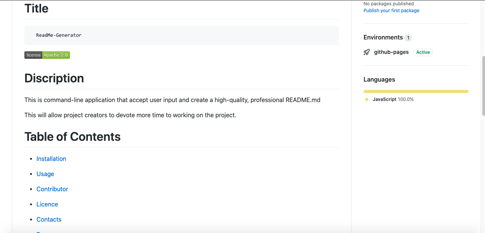

# Title
  ```  
    ReadMe-Generator 
  ```  
    

  [](https://opensource.org/licenses/Apache-2.0)    
  
   

  # Discription   

  This is command-line application that accept user input and create a high-quality, professional README.md

 
  This will allow project creator to devote more time to working on the project.   
    

  # Table of Contents  

    
* [Installation](#installation)
    
* [Usage](#usage)
    
* [Contributor](#contributor)
    
* [License](#license)      
    
* [Contacts](#contacts)
    
* [Programming-Language](#programming-language)

    ## Installation 

    1. Clone the repo: https://github.com/Afam-26/ReadMe-Generator.git
    2. Install NPM packages: npm install
    3. npm i inquirer

    ## Usage

    When a user enter their project title, it will be displayed as the title of the README.
    When a user enter a description, installation, contributions, etc; then, 
    these information is added to the sections of the README assigned for it. 
    The application will be invoked by using the following command: node index.js


    

    ## Contributor

    none

    ## Lincense

    This Project is licensed by Apache license

    [Read more by clicking here!](https://opensource.org/licenses/Apache-2.0)

  
    ## Contacts Info

    Please reach out to me if you have any questions.

    Email: afam262@gmail.com

    Github Username: Afam262

    [Github link](https://afam-26.github.io/ReadMe-Generator/) 

    ## Programming-Language 
    ```
    Java-Script
    ```
    
    